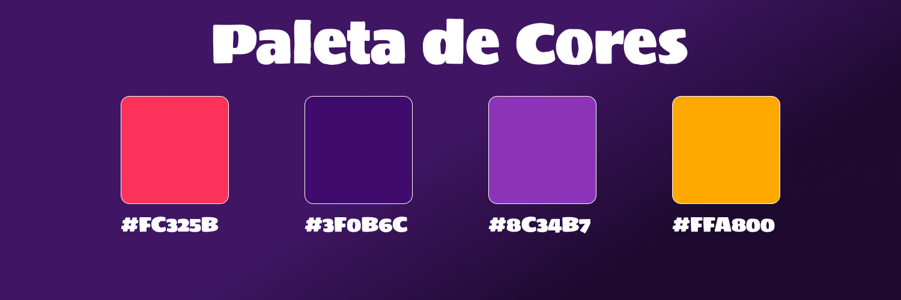

# Design do Projeto

+ ## Paleta de cores:
  Essa paleta foi escolhida pela dominancia da cor roxa, que é responsável por transmitir ao usuário a sensação de criatividade e imaginação, e ao mesmo tempo a ideia de calma e relaxamento.
  

+ ## Tipografia:

+ ## Estilos de Botões:

+ ## Estilos de Imagens:

+ ## Layout Responsivo:

+ ## Wireframes de Baixo Nível: